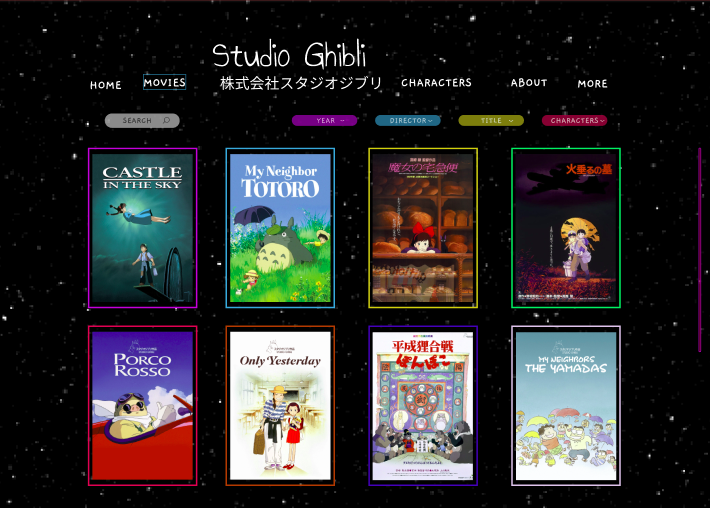

# Data Lovers

## 1. Definição do Produto

Neste projeto, contruímos uma _página web_ para visualizar um _conjunto
(set) de dados_**. Esta página web, permite **visualizar dados, filtrá-los, ordená-los e fazer algum cálculo agregado**, com foco na necessidade do usuário.

## 2. Tema do Projeto e História - Studio Ghibli

“O Quente Vento do Deserto do Saara”. Para muitos, essa frase pode não fazer sentido algum, mas para Hayao Miyazaki, esse vento que se chama Ghibli seria aquele mudaria para sempre a história da animação mundial.

Graças ao sucesso alcançado por Nausicaä do Vale do Vento em 1984, no ano seguinte, em 1985, nascia o Studio Ghibli. Sua história, porém, começa 30 anos antes com o encontro de Hayao Miyazaki e Isao Takahata, futuros pais do estúdio.

Em 1974 os dois se encontravam durante a produção de um anime de grande sucesso no mundo inteiro – inclusive no Brasil – Heidi. Enquanto Isao Takahata dirigia as séries, Hayao Miyazaki fazia um trabalho sobre-humano para conseguir desenhar o layout de cada episódio detalhadamente.

Isso fez com que os dois percebessem que para fazer as animações de alta qualidade, como desejavam, precisariam de um tipo de mídia onde os prazos não fossem tão apertados como são nas séries de televisão. Foi assim que surgiu a ideia da criação de um estúdio para produzir filmes cuidadosamente desenhados, com enredo e qualidade impecáveis, e o mais importante, de seu próprio jeito.

## 3. Histórias de usuários

## 4. Desenvolvendo nosso Protótipo

## 5. Interface do Usuário

## 6. Ferramentas utilizadas no projeto
- Monday para estruturação dos objetivos e sprints;
- Miro para desenhar o fluxo de criação;
- Figma para o desenho do protótipo;
- Canva para ajuste de imagens;
- Aplicações de fontes para estilização do tema;

